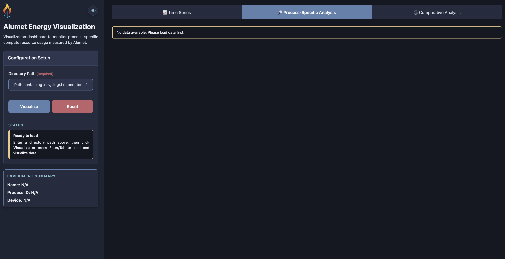
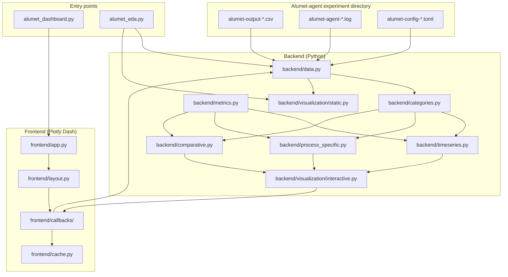

# AlumetInsight

**Synopsis.** AlumetInsight is an open-source Python package for interactively exploring and visualizing energy, power, and resource-utilization measurements produced by [Alumet-agent](https://alumet-dev.github.io/user-book/start/install.html). It provides a browser-based Plotly Dash dashboard and a command-line interface for summarizing experiments, exporting processed data, and generating publication-ready figures from post-hoc Alumet CSV outputs.



## Table of Contents

1. [Abstract](#abstract)
2. [Keywords](#keywords)
3. [Overview](#overview)
   - [Introduction](#introduction)
   - [Implementation and Architecture](#implementation-and-architecture)
   - [Usage](#usage)
     - [Tutorial: Your First Experiment Analysis](#tutorial-your-first-experiment-analysis)
     - [Dashboard Reference](#dashboard-reference)
     - [Command-Line Interface Reference](#command-line-interface-reference)
   - [Quality Control](#quality-control)
4. [Availability](#availability)
   - [Operating System](#operating-system)
   - [Programming Language](#programming-language)
   - [Dependencies](#dependencies)
   - [Installation](#installation)
   - [Software Location](#software-location)
   - [Contributors](#contributors)
5. [Reuse Potential](#reuse-potential)
6. [Citation](#citation)
7. [Contributing](#contributing)
8. [Contact](#contact)
9. [License](#license)
10. [Funding and Acknowledgments](#funding-and-acknowledgments)
11. [Competing Interests](#competing-interests)
12. [References](#references)

## Abstract

Measuring the energy consumption and resource utilization of high-performance computing (HPC) workloads is essential for understanding software efficiency and driving sustainable system design. Established tools such as [LIKWID](https://github.com/RRZE-HPC/likwid), [PMT](https://arxiv.org/abs/2210.03724), and [Variorum](https://variorum.readthedocs.io/en/latest/) provide hardware-domain-level (socket or package) power measurements, but do not natively attribute consumption to individual
processes without dedicated node access or source-code instrumentation. [Alumet-agent](https://alumet-dev.github.io/user-book/intro.html) addresses this limitation: it is a lightweight, Rust-based measurement agent
that samples energy, power, and utilization metrics at the process level and sub-second resolution, using low-level OS interfaces without requiring modification of the application under study. However, the rich, process-granular CSV output that Alumet produces lacks a purpose-built analysis layer. 
We, therefore, present **AlumetInsight**, an open-source Python tool that fills this gap. AlumetInsight provides an interactive browser-based dashboard built on [Plotly Dash](https://dash.plotly.com/), for loading, filtering, and comparing Alumet experiment outputs across runs, as well as a command-line interface for scripted summaries, CSVs or figures
exports. AlumetInsight is released under the MIT
License and is openly developed on GitHub.

<!-- TODO: Add sentence with Zenodo DOI / repository identifier once archived. -->

## Keywords

energy measurement; power profiling; HPC resource utilization; process-specific attribution; data visualization; exploratory data analysis; reproducible research software

## Overview

### Introduction

Modern scientific computing increasingly relies on understanding the energy footprint of numerical workloads, both for cost efficiency and for environmental sustainability. Energy cost is now a major component of HPC
operational budgets, and "green computing" has emerged as an active research area in which the trade-off between time-to-solution and
energy-to-solution must be empirically characterized. Capturing and making sense of these dynamics requires tooling that is lightweight enough to deploy on production HPC nodes and expressive enough to surface meaningful trends at the granularity of an individual process or metric family.

#### Existing HPC energy measurement tools.

Several mature tools address parts of this problem. 
[LIKWID](https://github.com/RRZE-HPC/likwid) is a command-line toolsuite and C library that
reads hardware performance counters and RAPL energy registers at the hardware-thread
and socket level; its Marker API lets developers annotate specific code regions,
but energy attribution remains at the hardware-domain (socket/package) granularity
and requires either root privileges or a pre-installed access daemon. The Power
Measurement Toolkit ([PMT](https://arxiv.org/abs/2210.03724)) provides a C++ library with a unified API over vendor energy interfaces (RAPL for CPUs, NVML for NVIDIA GPUs, rocm-smi for AMD
GPUs), and likewise supports user-delimited measurement sections through explicit
markers inserted into source code; measurements represent power drawn by the
hardware domain, not by an individual process. [Variorum](https://variorum.readthedocs.io/en/latest/), developed at Lawrence Livermore National Laboratory as part of the ECP Argo project, is a vendor-neutral C library that exposes both power monitoring and power-capping
APIs via a JSON interface; it is designed primarily for integration into system
software stacks and job schedulers, with socket and node as the native measurement
granularity.

A key limitation shared by all three tools is that they measure hardware power domains (typically the CPU package and GPU card), which aggregate the consumption of all processes running concurrently on the node. On shared or multi-tenant HPC nodes, this makes it impossible to isolate the energy footprint of a single application without either monopolizing the node or instrumenting the application's source code. Neither option is always feasible.

#### Why Alumet?

[Alumet-agent](https://alumet-dev.github.io/user-book/intro.html) takes a different approach. It is a Rust-based,
plugin-driven measurement agent that instruments the operating system rather than
the application. By using the Linux perf_event_open interface and process-level
OS accounting, Alumet can attribute CPU utilization and, through a power model,
energy consumption to individual processes without modifying or recompiling
the target application. This process-specific measurement capability is the
key reason we chose Alumet as the underlying measurement framework: it allows
researchers on shared HPC nodes to characterize the energy footprint of a single
benchmark or workload in isolation, even while other processes are active.
Additional advantages include low overhead (Rust implementation optimized for
minimal latency), sub-second sampling resolution, a modular plugin architecture
that can be extended to new hardware sources, and known corrections to bugs
present in some existing RAPL-based software powermeter.

- **Process-specific fine-grained measurement.** Alumet's unified metric model tags each sample with resource and consumer dimensions (for example, `_C_process_<pid>_`), so downstream analysis can restrict plots and exports to the active window of the measured workload.
- **Modular, extensible pipeline.** Plugins add sources (RAPL, perf, GPU, kernel statistics), transforms (energy attribution models), and outputs (CSV) without rewriting the agent core.
- **Measurement correctness.** Alumet explicitly addresses known pitfalls in software-based CPU energy measurement identified in comparative studies of RAPL tooling.
- **Operational CSV output.** Experiments produce self-contained directories (`alumet-config-*.toml`, `alumet-agent-*.log`, `alumet-output-*.csv`) that AlumetInsight ingests directly—no live streaming stack required.

Table 1 summarizes the key distinctions between the tools discussed above.

| Tool | Language | Measurement level | Process attribution | Instrumentation required | Primary interface |
|---|---|---|---|---|---|
| LIKWID | C | Hardware thread / socket | x | Marker API (source code) | CLI + library |
| PMT | C++ | Hardware power domain | x | Marker API (source code) | Library |
| Variorum | C | Node / socket | x | API calls (source code) | Library + JSON |
| **Alumet** | **Rust** | **Process + hardware domain** | **v** | **None (agent-based)** | **Agent + CSV** |

*Table 1: Comparison of HPC energy measurement tools.*

#### Alumet Insight.

While Alumet's process-granular, agent-based measurements address the data-collection gap, the rich CSV output it produces containing
timestamped records of energy, power, CPU utilization, GPU metrics, and other
quantities at the per-process level still requires substantial ad-hoc scripting
to explore interactively or to compare across multiple experimental runs. General-purpose
tools such as `pandas` and `matplotlib` can process this output, but impose non-trivial boilerplate for each new experiment. Streaming monitoring stacks (e.g., Grafana + InfluxDB) are oriented toward real-time dashboarding
rather than post-hoc exploratory data analysis of stored CSV files.

Alumet Insight closes this remaining gap by providing a cohesive,
experiment-centric analysis layer that understands Alumet's CSV schema natively.
It enables researchers to load one or multiple experiment directories, filter by
process or metric, select time windows, compare runs side-by-side, and export
processed data or publication-ready figures — without writing any additional code.


### Implementation and Architecture

AlumetInsight is implemented in Python 3.12 and organized into four layers:

| Layer | Location | Responsibility |
|-------|----------|----------------|
| **Dashboard entry** | `alumet_dashboard.py` | Boots the Dash server on port 8051; wires layout and callbacks. |
| **Main entry** | `alumet_insight.py` | Non-interactive summaries or interactive Dash app. |
| **Frontend** | `frontend/` | Plotly Dash layout, reactive callbacks, client-side theme, and DataFrame caching. |
| **Backend** | `backend/` | Alumet CSV ingestion, metric categorization, tab-specific analytics, and figure builders. |

#### Backend modules

- **`backend/data.py`** — Discovers measurement files in an experiment directory, reads CSV via Polars (with Parquet sidecar caching), parses Alumet column semantics, and exposes the `AlumetData` container with original and preprocessed DataFrames plus process-active time bounds.
- **`backend/categories.py`** — Maps raw metrics into analysis categories (energy, power, utilization, temperature, memory, perf counters, kernel CPU time, kernel/system, miscellaneous).
- **`backend/metrics.py`** — Metric-ID parsing, cumulative vs. instantaneous detection, byte-axis formatting, and process-consumer identification.
- **`backend/timeseries.py`** — Y-axis shareability, category labels, and time-window helpers for the Time Series tab.
- **`backend/process_specific.py`** — Cascading filter normalization, grid export preparation, and process-window scoping for the Process-Specific tab.
- **`backend/comparative.py`** — Metric pairing, timestamp alignment (`merge_asof`), and scatter/cumulative modes for the Comparative tab.
- **`backend/visualization/interactive.py`** — Plotly figure construction for dashboard tabs.
- **`backend/visualization/static.py`** — Matplotlib exports for CLI `--export-figures`.

#### Frontend modules

- **`frontend/app.py`** — Dash application instance (Bootstrap theme, assets).
- **`frontend/layout.py`** — Sidebar configuration panel and three-tab main area.
- **`frontend/callbacks/`** — `lifecycle.py` (load/reset/theme/tab switching), `timeseries.py`, `process_specific.py`, `comparative.py`.
- **`frontend/cache.py`** — Server-side caching of large DataFrames (Parquet-backed) to keep tab switches responsive.

#### Architecture diagram



**Data flow.** A researcher supplies an experiment directory path. The lifecycle callback invokes `AlumetData` to ingest CSV/log/config files, preprocess metric IDs, and derive the process-active interval. Preprocessed DataFrames are stored in Dash `dcc.Store` components and the server-side cache. Tab callbacks query backend helpers to filter by category, resource, or consumer, build Plotly figures, and expose per-plot CSV export actions. The CLI reuses the same backend path, writing summaries and static figures to disk for batch workflows.

## Usage

AlumetInsight supports two modes of operation. The **dashboard** is the primary interface for interactive exploration in a browser. The **CLI** (`alumet_eda.py`) is designed for scripted, reproducible workflows in pipelines or Makefiles.

### Tutorial: Your First Experiment Analysis

This tutorial walks through loading a real Alumet-agent experiment output, exploring metrics in the dashboard's three tabs, and exporting a summary CSV.

#### Prerequisites

You have completed [Installation](#installation) and have an Alumet-agent experiment directory at hand. Example outputs are available at [energy_measurement](https://github.com/thealanjason/energy_measurement) under `measurement_tools/alumet/experiments/`.

#### Step 1. Activate the environment and start the dashboard

```bash
conda activate alumet-insight
python alumet_dashboard.py
```

Open `http://localhost:8051` in your browser. You will see the AlumetInsight dashboard with an empty configuration sidebar and three tabs in the main panel: **Time Series**, **Process-Specific Analysis**, and **Comparative Analysis**.

#### Step 2. Load an experiment directory

In the **Configuration Setup** panel on the left, enter the path to your Alumet-agent experiment folder (it must contain the `.toml` config, agent log, and output CSV), then click **Visualize**. AlumetInsight discovers the measurement files, populates internal stores, and displays experiment metadata (name, PID, device) in the **Experiment Summary** card.

<!-- TODO: Add a screenshot here (images/tutorial_step2.png). -->

#### Step 3. Explore the three dashboard tabs

Once data is loaded, use the tabs as follows:

1. **Time Series** — Select a metric category (for example, Power (W) or Energy (J)). The pane renders vertically stacked subplots for all series in that category, with the process-active interval highlighted. Use linked x-axis zoom and the optional shared Y-axis toggle for directly comparable scales.
2. **Process-Specific Analysis** — Inspect up to four individually configured metric series in a 2×2 grid, automatically scoped to the process-active time range. Each panel supports cascading filters by metric, resource, and consumer.
3. **Comparative Analysis** — Choose two metrics from the process window and compare them as a dual-axis time series, scatter plot, or cumulative plot. Toggle **process-only** filtering to restrict options to process-attributed series.

For annotated screenshots and advanced controls, see [docs/how-to-use.md](docs/how-to-use.md).

#### Step 4. Export the processed summary

Each interactive plot includes an **Export CSV** control to download a tidy summary of the displayed series. For non-interactive batch export, use the CLI:

1. Quick summary:

```bash
python alumet_eda.py /path/to/alumet/experiment/dir --summary
```

2. Data processing and export as CSV:

```bash
python alumet_eda.py /path/to/alumet/experiment/dir --export-csv /path/to/saved/results
```

Add `--process-specific` to restrict exports to the process-active region.

3. Visualize the processed data and save as figures:

```bash
python alumet_eda.py /path/to/alumet/experiment/dir --export-figures /path/to/saved/results
```

Optional flags: `--process-specific`, `--category <name>`, `--figure-format png|pdf|svg`, `--dpi <int>`.

### Dashboard Reference

| Tab | Purpose | Key controls |
|-----|---------|--------------|
| Time Series | Browse all metrics in a category as stacked time-series subplots | Metric category dropdown, CPU-core cascade (kernel categories), shared Y-axis toggle, linked zoom |
| Process-Specific Analysis | Compare up to four metric series side-by-side within the process window | Per-panel metric/resource/consumer filters, 2×2 grid layout |
| Comparative Analysis | Relate two metrics (time-aligned, scatter, or cumulative) | X/Y metric selectors, process-only toggle, visualization mode |

Full control descriptions and screenshots: [docs/how-to-use.md](docs/how-to-use.md).

### Command-Line Interface Reference

```
python alumet_eda.py DIRECTORY [--summary]
                              [--export-csv OUTPUT_DIR]
                              [--export-figures OUTPUT_DIR]
                              [--category {energy,power,utilization,...}]
                              [--cpu-core CORE]
                              [--process-specific]
                              [--figure-format {png,pdf,svg}]
                              [--dpi INT]
```

Exports are written under `OUTPUT_DIR/<measurement-folder-name>/`.

### Quality Control

#### Smoke test (manual)

After installation, verify the environment by launching the dashboard against example data in [energy_measurement](https://github.com/thealanjason/energy_measurement):

```bash
conda activate alumet-insight
python alumet_dashboard.py
# Navigate to http://localhost:8051 and load an example experiment directory
```

A successful launch without import errors, populated experiment summary, and rendered plots in all three tabs confirm that dependencies are installed correctly.

#### Automated unit tests

The `refactor_final` branch includes a `pytest` suite (`tests/`, configured via `pytest.ini`) with **55 unit tests** covering:

| Test module | Focus |
|-------------|-------|
| `tests/test_data.py` | CSV ingestion, Polars/Parquet I/O, metric-ID preprocessing, process time-range detection |
| `tests/test_categories.py` | Category assignment and filtering |
| `tests/test_metrics.py` | Cumulative vs. instantaneous metrics, process-consumer detection |
| `tests/test_timeseries.py` | Y-axis shareability and category labels |
| `tests/test_process_specific.py` | Grid filter normalization and export preparation |
| `tests/test_comparative.py` | Process-window metric pairing and alignment |
| `tests/test_cache.py` | Server-side DataFrame cache behavior |
| `tests/test_helpers.py` | Frontend helper utilities |

Run the full suite from the repository root:

```bash
conda activate alumet-insight
pytest
```

All tests should pass before tagging a release or submitting the JORS software archive.

## Availability

### Operating System

Linux (tested on Ubuntu 24.04 LTS and later); macOS (tested on macOS 26.5 Tahoe); Windows (not tested, but no known platform-specific dependencies in AlumetInsight itself—note that Alumet-agent measurement is Linux-only).

### Programming Language

Python 3.12 (see `environment.yml`).

### Dependencies

Core dependencies: `pandas`, `polars`, `pyarrow`, `numpy`, `matplotlib`, `dash`, `dash-bootstrap-components`, `toml`. A fully pinned environment is provided in `environment.yml`.

### Installation

>[!NOTE] Prerequisites: [conda](https://www.anaconda.com/docs/getting-started/miniconda/install/overview) or [micromamba](https://mamba.readthedocs.io/en/latest/installation/micromamba-installation.html) must be installed.

```bash
# 1. Clone the repository
git clone https://github.com/thealanjason/alumet-insight.git
cd alumet-insight

# 2. Check out the refactored production layout (recommended)
git checkout refactor_final

# 3. Create and activate the conda environment
conda env create -f environment.yml
conda activate alumet-insight
```

### Software Location

**Code repository**

| Field | Value |
|---|---|
| Name | GitHub |
| Persistent identifier | https://github.com/thealanjason/AlumetInsight |
| Licence | MIT |
| Date published | <!-- TODO: Add date --> |

**Archive (for peer review)**

| Field | Value |
|---|---|
| Name | Zenodo |
| Persistent identifier | <!-- TODO: Add Zenodo DOI after depositing --> |
| Licence | MIT |
| Version | <!-- TODO: Tag a release version --> |
| Date published | <!-- TODO: --> |

### Contributors

- Chia-Hao Chang: Software development, documentation
- Alan Correa: Conceptualization, scientific supervision, methodological guidance and critical review of the software design

See also [Contributing](#contributing) for how to join the project.

## Reuse Potential

AlumetInsight is designed to be reusable beyond its original development context. The backend data layer (`backend/data.py` and related modules) makes no assumptions about the application domain of the measured workload: it treats Alumet-agent CSV output as a generic time series of labelled metric samples with resource and consumer dimensions. Any researcher using Alumet-agent to profile HPC applications—whether in fluid dynamics, machine learning training, molecular dynamics, or bioinformatics—can use AlumetInsight directly for exploratory analysis of energy consumption and hardware utilization.

The dashboard is parameterized through the sidebar at runtime, making it straightforward to adapt when Alumet-agent adds new measurement plugins or metric families. Users wishing to extend the tool can add aggregation strategies or category rules in `backend/`, new Plotly builders in `backend/visualization/interactive.py`, or additional Dash panels in `frontend/` by following the [contribution guidelines](#contributing). Because the CLI and dashboard share the same backend, scripted pipelines and interactive sessions remain consistent.

## Citation

If you use AlumetInsight in your research, please cite the associated JORS software metapaper:

```bibtex
@article{alumet-insight-jors,
  author  = {<!-- TODO: Author list -->},
  title   = {AlumetInsight: A Python Tool for Interactive Exploration of
             Alumet-Agent Energy and Resource Measurements},
  journal = {Journal of Open Research Software},
  year    = {<!-- TODO -->},
  volume  = {<!-- TODO -->},
  doi     = {<!-- TODO: JORS DOI -->}
}
```

## Contributing

Contributions are welcome. The most useful ways to contribute are:

- **Reporting bugs** — open an Issue with a minimal reproducible example including your Alumet-agent version and a sample (or mock) of the CSV that triggers the problem.
- **Requesting features** — open an Issue describing your use case and which metric or workflow you would like to see supported.
- **Submitting code** — fork the repository, create a feature branch, and open a Pull Request. Please include a brief description of the change and, where applicable, add or update tests under `tests/`.
- **Improving documentation** — edits to `README.md` or `docs/` are welcome, especially worked examples using different Alumet-agent metric types.

<!-- TODO: Add a CONTRIBUTING.md with coding standards, branch naming conventions, and review process. -->

## Contact

For questions, bug reports, or general feedback, please open an [Issue on GitHub](https://github.com/thealanjason/alumet-insight/issues).
For private enquiries, contact the corresponding author at <!-- TODO: Add email address -->.

## License

AlumetInsight is released under the MIT License.
<!-- TODO: Add LICENSE file -->

## Funding and Acknowledgments

The authors thank the Alumet development team for the underlying measurement framework and for prompt responses to our issues. We acknowledge RWTH MBD for the use of the GAIA GPU cluster.

This README was structured following the [Journal of Open Research Software (JORS)](https://openresearchsoftware.metajnl.com/) software metapaper outline and version 1 of the [One Good Tutorial software documentation checklist](https://doi.org/10.5281/zenodo.19338407), which recommends a synopsis, one hands-on tutorial, installation and citation instructions, contribution and licensing statements, reference material, and acknowledgments as the minimum viable documentation set for new scientific software.

## Competing Interests

The authors have no competing interests to declare.

## References

Alumet-agent and comparative measurement literature:

```bibtex
@software{raffin2025alumet,
  author       = {Raffin, Guillaume},
  title        = {Alumet: Adaptive, Lightweight, Unified Metrics},
  year         = {2025},
  url          = {https://github.com/alumet-dev/alumet},
  note         = {User guide: https://alumet-dev.github.io/user-book/}
}

@article{raffin2024dissecting,
  author  = {Raffin, Guillaume and Trystram, Denis},
  title   = {Dissecting the Software-Based Measurement of {CPU} Energy Consumption: A Comparative Analysis},
  journal = {IEEE Transactions on Parallel and Distributed Systems},
  year    = {2024},
  volume  = {36},
  number  = {1},
  pages   = {96},
  doi     = {10.1109/TPDS.2024.3492336},
  note    = {HAL hal-04420527}
}
```

Related measurement tools:

```bibtex
@inproceedings{corda2022pmt,
  author    = {Corda, Stefano and Veenboer, Bram and Tolley, Emma},
  title     = {{PMT}: Power Measurement Toolkit},
  booktitle = {2022 IEEE/ACM International Workshop on HPC User Support Tools (HUST)},
  year      = {2022},
  pages     = {44--47},
  doi       = {10.1109/HUST57134.2022.00012},
  url       = {https://arxiv.org/abs/2210.03724}
}

@misc{variorum,
  author       = {{Lawrence Livermore National Laboratory}},
  title        = {Variorum: Vendor-Neutral Power and Performance Monitoring},
  year         = {2024},
  url          = {https://variorum.readthedocs.io/en/latest/},
  note         = {Source: https://github.com/LLNL/variorum}
}

@inproceedings{treibig2010likwid,
  author    = {Treibig, Jan and Hager, Gerhard and Wellein, Gerhard},
  title     = {{LIKWID}: A Lightweight Performance-Oriented Tool Suite for x86 Multicore Environments},
  booktitle = {Proceedings of PSTI2010, the First International Workshop on Parallel Software Tools and Tool Infrastructures},
  year      = {2010},
  address   = {San Diego, CA},
  doi       = {10.1109/ICPPW.2010.38},
  url       = {https://arxiv.org/abs/1004.4431}
}
```

Visualization dependencies:

```bibtex
@software{plotly_py,
  author  = {Kruchten, Nicolas and Seier, Andrew and Parmer, Chris},
  title   = {An Interactive, Open-Source, and Browser-Based Graphing Library for {Python}},
  year    = {2024},
  doi     = {10.5281/zenodo.14503524},
  url     = {https://github.com/plotly/plotly.py}
}

@software{plotly_dash,
  author  = {Parmer, Chris and Duval, Philippe and Johnson, Alex},
  title   = {A Data and Analytics Web App Framework for {Python}, No JavaScript Required},
  year    = {2025},
  doi     = {10.5281/zenodo.14182630},
  url     = {https://github.com/plotly/dash}
}
```

Documentation methodology:

```bibtex
@misc{onegoodtutorial1.0.1,
  author       = {Williams, Peter K. G.},
  title        = {One Good Tutorial (version 1.0.1)},
  year         = {2026},
  publisher    = {Zenodo},
  version      = {1.0.1},
  doi          = {10.5281/zenodo.19338407},
  url          = {https://doi.org/10.5281/zenodo.19338407}
}
```
