# `alumet-eda`/`alumet-insight` User Guide

## Step 1: Load Experiment 

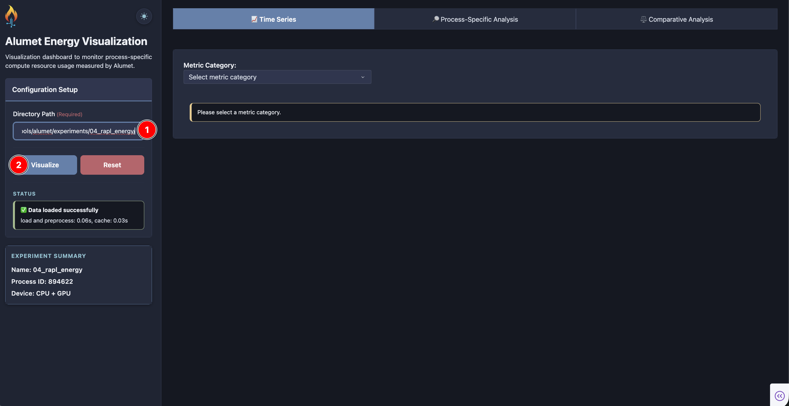

As shown in the screenshot, the procedure to setup an experiment for exploration and analysis is as follows:

1. Enter the path to an Alumet experiment directory in **Directory Path**.
> [!IMPORTANT] 
> 
> To run the dashboard successfully, the input configuration directory should contain an `alumet-config-<experiment>.toml` file and the resulting `alumet-agent-<experiment>.log` and `alumet-output-<experiment>.csv` files. Examples can be found [here](https://github.com/thealanjason/energy_measurement/tree/main/measurement_tools/alumet/experiments)

2. Click **Visualize** (or press Enter/Tab in the path field).

A **Status** message will be shown to give you the hint whether the experiment is loaded successfully or not. The **Experiment Summary** provides information about experiment name, process ID, device type.

> [!TIP]
> 
> Use **Reset** to clear loaded data and start over. 

## Step 2: Explore Data and Gain Insight

There are three tab options with scrollable tab content:

### 1. Time Series tab

In this pane, you can view time-series data for all metrics captured during the experiment. The data is visualized as vertically stacked subplots for the selected category, with the active period of the measured process highlighted. Each time-series is identified by a unique combination of base metric, resource, consumer, and any additional attributes.

#### Basic Usage

1. Choose a **Metric Category** from the dropdown. Available categories depend on your measurement (e.g. Energy (J), Power (W), Utilization, Temperature, Memory, Perf Counters, Kernel CPU Time, Kernel/System, Miscellaneous).

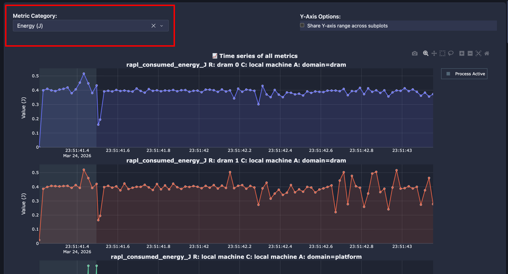

2. Depending on the chosen category, additional dropdowns may appear. For example, selecting **Kernel CPU Time** reveals a **CPU Core** dropdown — choose a core to display its kernel CPU time.

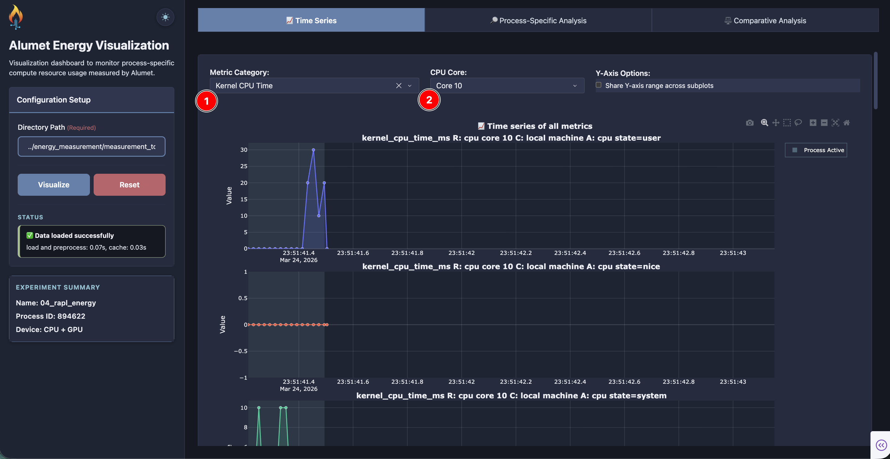

#### Additional Useful Features

- **Linked x-axis zoom:** Zoom or pan any subplot using the mouse to select a time region of interest. 

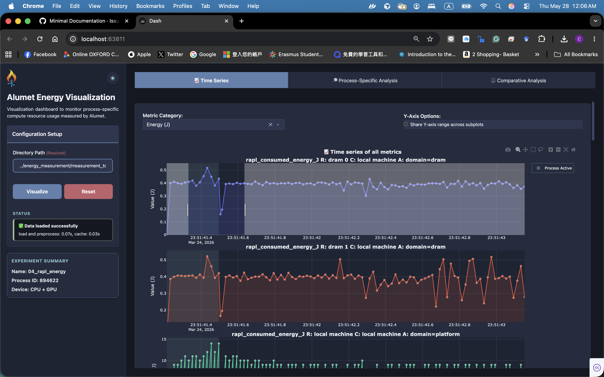

Then all subplots will be synced with the same time window:

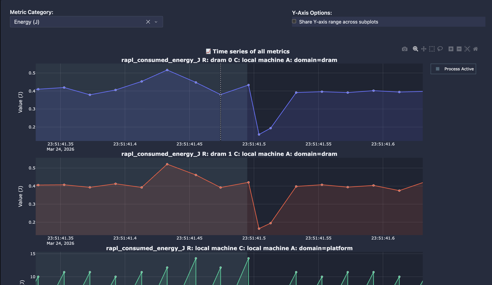

*Double-click* anywhere on a subplot to revert to the original scale. 

- **Share Y-axis range across subplots:** For categories with a common unit (Energy, Power, Utilization, Temperature, Memory, Kernel CPU Time), enable the *Shared Y-axis range* checkbox to make subplots directly comparable on the same scale. Disable it to give each subplot its own scale.

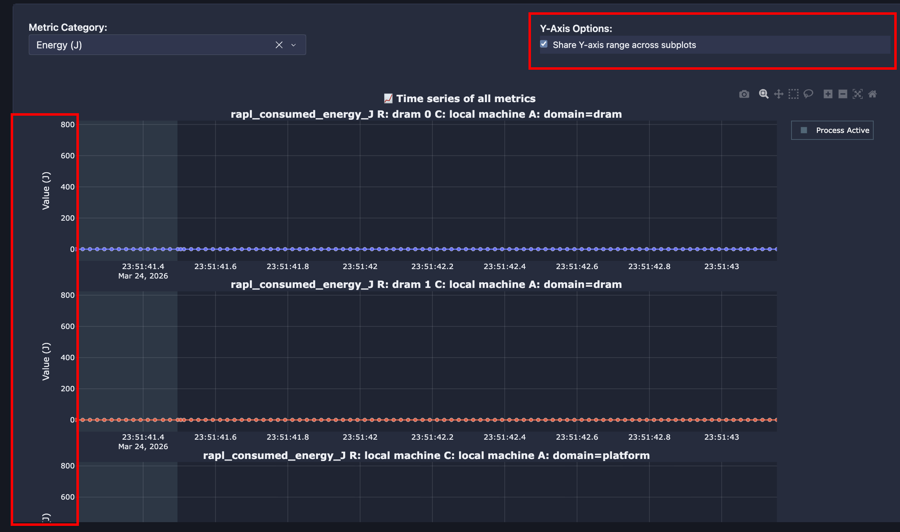

- **Process-active region:** A shaded area highlights the measured process active time range on every subplot.

- **Plotly toolbar:** Use the built-in controls to zoom, pan, reset axes, and download the figure as PNG.

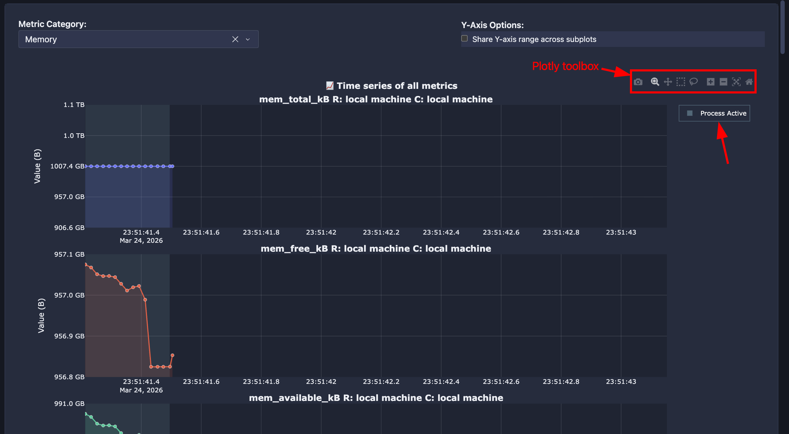

### 2. Process-Specific Analysis tab

In this pane, we can inspect up to four individual metric series side by side. Plots are arranged in a 2×2 grid, filtered to the process active time range, and each series can be independently configured by metric, resource, and consumer.

#### Basic Usage

1. In each of the four panels, select a **Metric** from the dropdown.

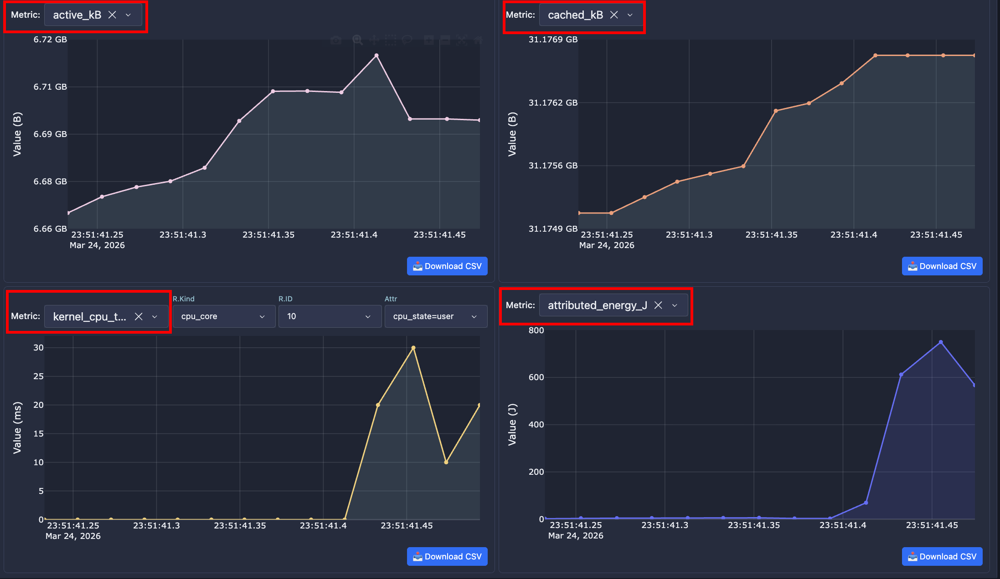

2. Use the cascading filters that appear below the metric selector to narrow the series:
   - **R.Kind** / **R.ID** — resource kind and resource ID
   - **C.Kind** / **C.ID** — consumer kind and consumer ID (e.g. `process` and PID)
   - **Attr** — late attributes when present

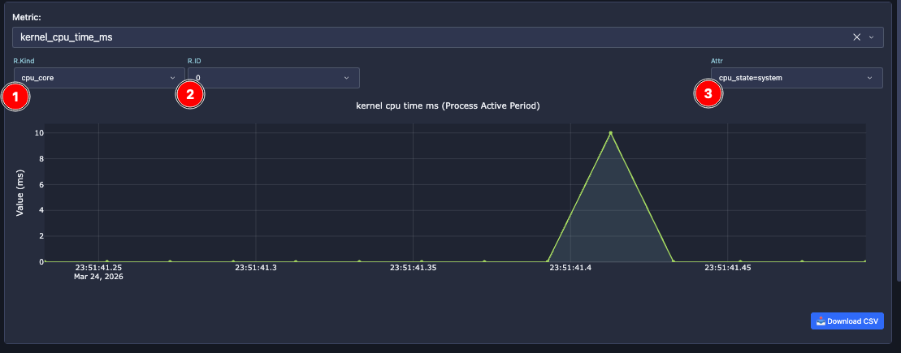

**Detailed Features**

- **Synchronized x-axis zoom:** Zooming the time axis in any panel applies the same time range to all four panels.
- **Per-panel CSV export:** Click **Download CSV** on a panel to export the currently selected series (filtered to the process window).

### 3. Comparative Analysis tab
**What it shows:** Compare two selected metric series IDs as a dual-axis time series or as an X–Y / cumulative relationship plot, using samples from the process active time window.

**How to use**

1. Choose **Metric 1** (X-axis / left Y-axis) and **Metric 2** (Y-axis / right Y-axis) from the dropdowns.

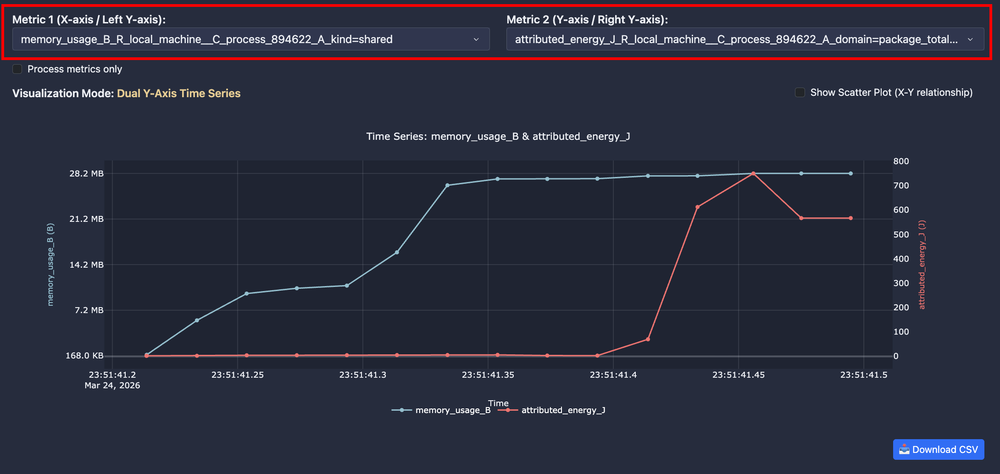

2. Optionally enable **Process metrics only** to restrict choices to series attributed to the measured process (`consumer_kind=process`).

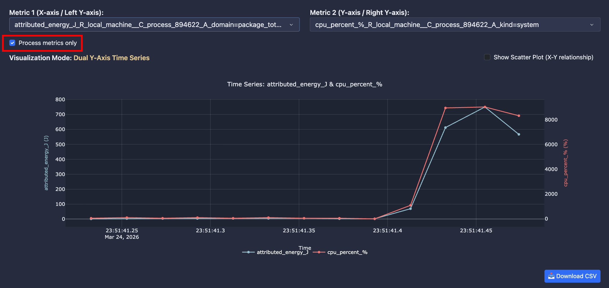

3. Read **Visualization Mode** below the dropdowns—it tells you which plot type will be drawn:
   - **Dual Y-Axis Time Series** — both metrics over time on one chart (left and right y-axes) when at least one metric is not cumulative.
   - **Cumulative X–Y Plot** — cumulative sum of X vs cumulative sum of Y when both metrics are cumulative (e.g. energy counters).

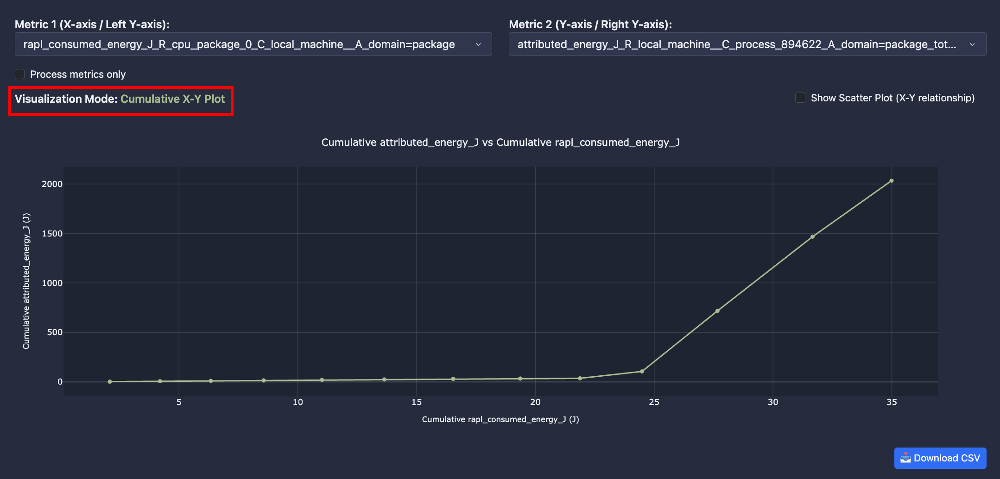

4. Enable **Show Scatter Plot (X–Y relationship)** to switch to a scatter view of Y vs X (useful for correlation, not time-ordered).

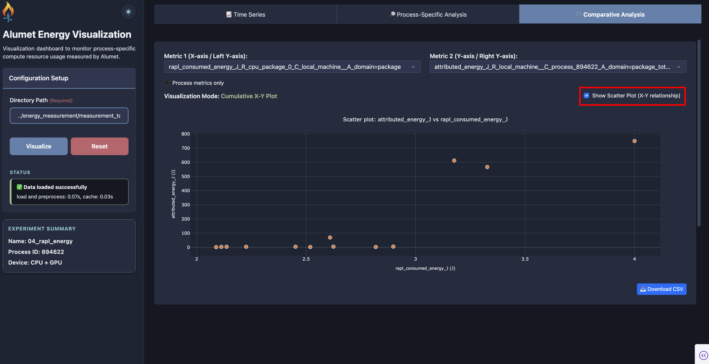

5. Click **Download CSV** to export the aligned X/Y data used in the current plot.